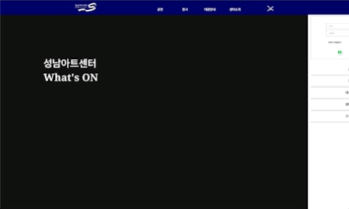

# Project TEAM Seongnam Art Center

## 3조. 주윤종 김현진 박지훈 최원빈 최홍준

-----------------
*ex-index는 연습장입니다

성남아트센터 홈페이지를 반응형웹으로 리뉴얼하였습니다.

사이트 링크 : https://jun-isaac.github.io/seongnam_team/


-----------------


-----------------
## 팀 공지사항
- ~~메뉴창이 안내려가요~~
  - 해결
-  

-----------------
## 구현 목표

- [x] 커튼이 열리며 영상 재생
- [x] header list 버튼 애니메이션
- [x] header mouse:hover 시에 depth2 메뉴
- [x] 측면 gnb
- [x] 백그라운드에서 블러 처리 된 영상 재생
- [x] 스크롤시 헤더 hide
- [x] 우측 하단에 fixed 된 버튼
- [x] 우측 하단에 fixed 된 버튼에서 검색 기능
- [x] 공연 section 포스터 좌우 슬라이더
- [x] 로그인 기능
- [x] 로그아웃 기능
- [ ] 전시 section에서 포스터 등장 애니메이션

-----------------
## 메인프레임

* 헤더, 푸터, 토글메뉴창이 모든 페이지마다 실행되도록 함
```c
 - 헤더
  - 헤더는 로고, GNB메뉴, 토글메뉴버튼으로 구성되어 있으며 토글메뉴버튼을 누르면 토글메뉴창이 열립니다.
  - 토글메뉴버튼은 클릭시 햄버거아이콘과 닫기버튼으로 변형됩니다.
  - 토글메뉴창 안에는 로그인기능, GNB메뉴가 있습니다.
  - 로그인버튼을 누르면
```

------------------
## 메인페이지


### 사용자를 환영하는 시작페이지
- 사이트에 접속하면 방문자를 환영하는 문구가 나타나고 스크롤을 내리면 좌우로 사라지며 백그라운드 동영상이 무한재생됩니다.


### 대관페이지
- 대관 할 수 있는 공연장을 slde 형태로 확인 가능합니다.

-------------------
## 로그인 창


 
- 로그인시 아이디가 localstorage에 저장 됩니다.
- 로그아웃 버튼을 누르기 전까지 데이터가 저장되어 있다가 로그아웃 버튼을 누르면 데이터가 삭제 되면서 logout 됩니다.

------------------
## 제품 페이지

* 

------------------
## 배운 것

* 백그라운드에 영상을 깔때 유튜브 링크로 넣는다면 control bar 혹은 button이 생겨서 미관상 좋지 않다. <br>
영상을 넣을일이 있다면 영상을 다운 받아서 넣자.

* pc와 css 모바일을 한 파일에 넣어서 만드려고 했는데 pc와 모바일 css가 겹쳐서
상당한 오류가 생겼다.<br>
다 만들고 나서 수정하려 했으나 이미 손쓸수 없는 지경이 되었다.<br>
반응형 홈페이지를 만들때는 귀찮더라도 section을 하나 만들때마다 pc와 모바일을 번갈아 가면서 만들고, css는 따로 나눠서 만드는 것이 유지,보수에 훨씬 좋은듯 하다.


------------------
## 상세 페이지

* 


## 사용 라이브러리
|JavaScript|HTML5|CSS|jQuery|
|---|---|---|---|
